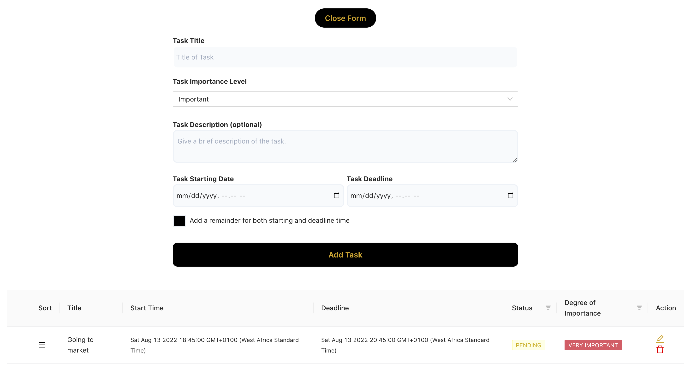
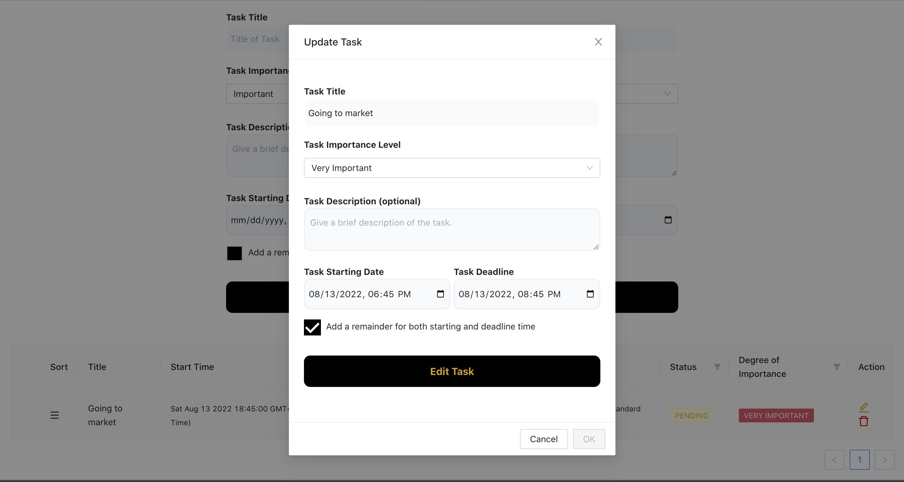

# Tasker-React App

<- `Tools used`: I used React Hooks such as (useState, useEffect, useImperativeHandle, useRef, useContext), antD (components), CSS, formik and yup(form handling), jest(testing), etc. To build this app. It allows you to carry simple operations such as add new tasks, edit them. set reminders, set start time and also optional deadline time. 

It is a simple app that shows the powerful use of react hooks.

## The live app page

Task can also be edited

